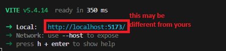
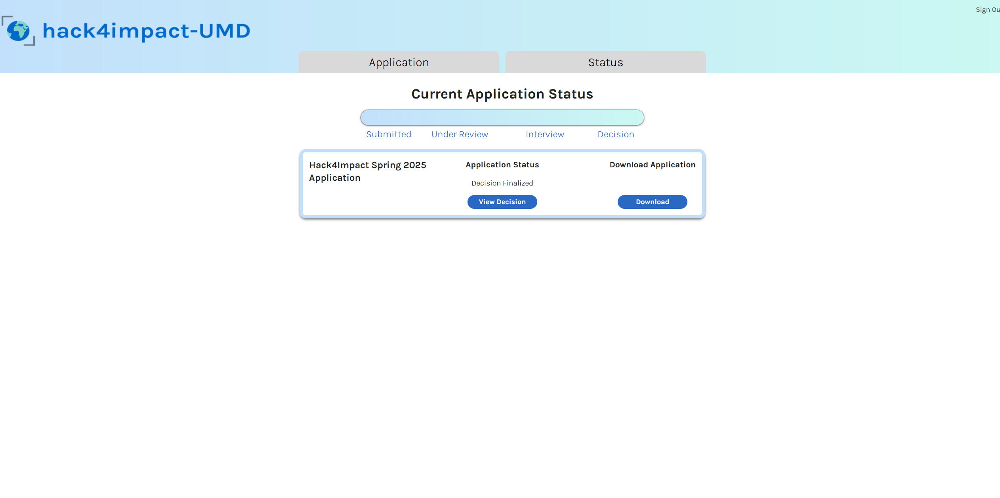

# H4I-InternalTools

> [!Tip]
> For data fetching best practices using React/Tanstack Query, see [DataFetching.md](DataFetching.md)

## Getting Started

Prerequisites
 - Git: https://git-scm.com/
 - Node: https://nodejs.org/en
   - _You may have to add node to your path variable: https://stackoverflow.com/a/27864253_

### Frontend

1) Use `git clone` to make a local copy of the repository.

```
git clone https://github.com/Hack4Impact-UMD/h4i-internal-application-tool.git
```

2) 'Change directory' to the project's frontend files.

```
cd h4i-internal-application-tool/frontend/
```

3) Run the following command to install project dependencies.

```
npm install
```

4) Still within the frontend directory, run:

```
npm run dev
```
then navigate to the generated URL





### Backend

> [!Tip]
> For Firebase emulator setup, see the backend [README](backend/README.md)
